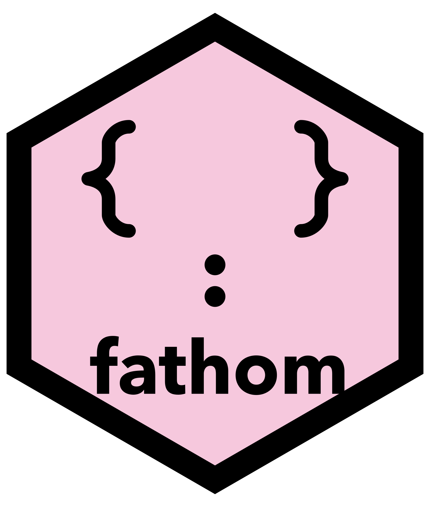
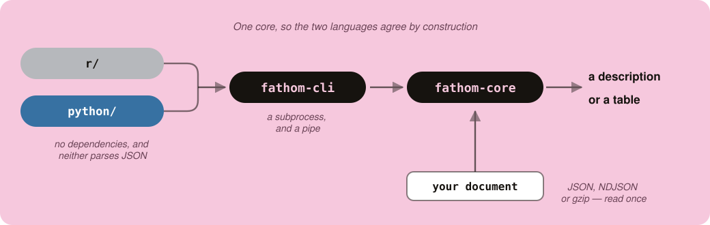

# fathom



**Fathom first. Then parse.**

**To fathom** something is to measure how deep it goes, and to finally understand
it. Both meanings are the job.

The goal is one way of **seeing** what is in a JSON document and **extracting**
what you want from it, that works the same in **R and in Python**, is intuitive
enough to read aloud, and stays learned. Nobody should have to avoid JSON the way
this project's author does.

**fathom is the first thing you reach for**, not the last. You point it at a
document you have never seen and it tells you what you are dealing with, and
whether the file is even sound. Then you take what you want. Being the *first
stab* is the scope: it is not trying to be everything you will ever do to that
document.

**Rectangling is not the goal**, corrected on 2026-08-08 and set out in full
below. **A table is the shape of your answer, never the shape of the document.**

**📖 The manual is online, and every report in it was produced by running
the frozen probe against the real corpus while the page was built:
<https://psychometrician.github.io/fathom-book/>**

**This began as an investigation and it now also has a package.** Both halves
are real, and the investigation is still the discipline: a graded corpus and a
findings document, every claim naming the file and the day it was measured.
`Status` below says what runs, and it is the only place that says so.

> **This paragraph said *"not a package yet"* until 2026-08-19** — while
> `Status`, in this same file, said **THE PACKAGE EXISTS**. The opening
> contradicted the section that owns the fact, which is the two-places failure
> this project has a rule against, in the first thing any reader sees.

**The working record is kept privately, and references to it are deliberate.**
Three documents are cited throughout this repository and are not in it:
`CLAUDE.md`, the working agreement; `FINDINGS.md`, every measurement with the
file and the day it was taken; and `VERDICT.md`, the session handoffs. They are
the process rather than the product — how this was built, including the wrong
turns — and they live in a private repository. **What they own is stated here
instead**: what the words mean is `design/vocabulary.md`, why the architecture is
one core behind a subprocess is `design/implementation.md`, and what a claim is
worth is the book, which recomputes every report from the real corpus at render
time rather than quoting a number.

---

## The problem

**With rectangular data you always know how to start.** A data.frame has already
answered "what is a row" before you arrive, so dplyr and tidyr work the same way
on every table you will ever meet. Technique transfers. That is why those two are
worth learning once.

**JSON never answers that question.** Every document makes you work it out from
scratch, which is why the code you wrote for one file is useless on the next one,
even when the two files are nominally the same kind of thing.

That is not a skill gap. It is a property of the format, and it is why this is a
different animal from every other data cleaning problem.

## Why this matters more than it used to

**JSON is no longer a thing you meet at an API boundary. It is everywhere**, and
the volume is growing rather than shrinking, so this is not a legacy problem that
better APIs will retire.

**Language model output is the newest case and probably the worst.** Structured
output, tool calls and agent traces all arrive as JSON, and models produce
genuinely inconsistent shapes: a field that is a string in one response and an
object in the next, arrays that are sometimes absent and sometimes empty, optional
keys that appear at whatever rate the prompt happened to induce. Anybody analyzing
a pile of model responses is doing exactly the work this project is about, and
most of them are doing it by hand.

**JavaScript data is the oldest case and has not gone away.** Anything scraped,
anything from a browser, anything from a config file or an event stream.

This also names the corpus gap. LLM output is the most likely **polymorphism
specimen**, which the corpus does not yet have.

## Where this comes from

*Reconstructed from conversation on 2026-08-08 and written in the author's voice.
Correct it where it is wrong; it is the load-bearing part of this document.*

Twenty years of working with data, and rectangular data is a solved problem. I
reach for dplyr and tidyr, and whatever shape the table arrives in, I know how to
start.

JSON is not like that. I have parsed a lot of it, and each time the next file
defeats the technique that worked on the last one. Not the ideas, the *code*.
Nothing carries over. That is genuinely frustrating in a way that badly shaped
tables never are.

**The hardest part is not the extraction. It is the exploring.** Before you can
write anything you have to find out what the document even has, how many levels it
goes down, and where the thing you want is living. That phase has no tooling worth
the name, and it is where the time goes.

**So what I actually do is avoid it.** I get the JSON into a data.frame as fast as
I possibly can, by whatever means, and then do the real work in tools I trust.
Avoidance is a reasonable strategy and it is also the symptom: I am routing around
a format rather than using it, and I do not think that is only me.

## Why both languages

**purrr is the best answer that exists and it is R only.** It is genuinely
versatile for deep JSON. It also has a syntax I have never enjoyed, so even in R
there is something to improve on.

**Python has no single answer at all.** glom, jmespath, pydash,
`pandas.json_normalize`, polars, DuckDB and ijson each cover a fragment, and none
of them is the one you learn. That is the same "five spellings of one idea"
problem that makes any of this hard to retain.

So a person who works in both languages, which is most people who touch a data
warehouse, learns two incomplete sets of habits and holds on to neither.

## What success looks like

The bar is deliberately the one this author's other projects set, because it is
the bar that decides whether a tool is worth anybody's afternoon:

> Read it on day one, write it on day two, and **still have it after a year
> away**.

Not remember that it exists. Be able to point it at a JSON file you have never
seen, twelve months after the last time, and get somewhere without opening the
reference.

That bar is what makes a small opinionated vocabulary worth more than a complete
one, and it is why this starts as research. A syntax that reads well and does not
survive the year is a failure that takes a year to detect, so the corpus exists to
find the pattern *before* anybody designs the words.

## What this might be beyond JSON

**Recorded 2026-08-08 as a hypothesis, not a scope decision**, because no tool
comparison has been run yet and the corpus exists to settle this with evidence.

**The operations that help with JSON are not JSON-specific.** Reaching in with a
default, taking the first value that is actually there, applying one thing across
many places: all of those read the same over a data frame as over a document.

**The reason they do is that these things differ in depth, not in kind.** A data
frame is a nested structure with exactly one level. A list-column makes it two.
JSON is N. tidyr's `nest` and `unnest` exist precisely because that boundary is
fluid. So this is not two features sharing a package. It is one feature with depth
as a parameter, and if that holds, one vocabulary spans all three and the package
is worth far more than a JSON tool.

**The floor, which this project needs and does not otherwise have. Split in two
on 2026-08-08, because the first version of it disqualified fathom's best idea:**

> **A word that touches the *data* earns its place by working at more than one
> depth. A word that touches the *medium* earns its place by having no analogue
> at depth one.**

A data word that only helps at depth one belongs in god. One that only helps at
depth N is JSON plumbing. One that reads the same at one, two and N is what
fathom is for.

**The second clause exists because of the health check, and it is a positive test
rather than an exemption.** There is no such thing as a broken data frame, so a
word that reports whether a document is sound has no depth-one analogue *by
construction*. The single-depth rule would have thrown it out, and the very
asymmetry it fails is what justifies it.

**A floor is not a stopping rule, and this document warned about that then did
not supply one.** It said "purrr, but nicer" inherits roughly 180 exports and has
no stopping rule, then gave a rule for *which* words qualify and none for *how
many*. So:

> **A word belongs in fathom only if removing it makes one of the fixed questions
> unanswerable on at least one corpus file. No word is added without naming the
> question it answers and the file that proves it.**

That makes `QUESTIONS.md` the vocabulary's specification and the corpus its
bound, mirroring a rule this project already trusts: an axis that never separates
two files is not an axis. It also explains purrr's 180 exports — purrr answers
questions nobody in this corpus asked.

**The version of this idea without a floor is what kills the project.** "purrr,
but nicer" inherits roughly 180 exports and has no stopping rule, and it dissolves
the sharp claim fathom has, which is that **every existing describer's output is
proportional to the data rather than to the structure**. A respelling of a library
that already exists is the outcome to avoid.

**The test is cheap and belongs in the method**: ask the fixed questions of a data
frame with list-columns as well as of a document, and see whether one vocabulary
answers both.

**One thing to decide consciously rather than discover.** If depth really is the
only difference, then god and fathom are the same project at two depths, and there
is a version of this where fathom's table half simply *is* god. Worth knowing
which is being built before words are chosen.

### Words shared with god — REVERSED BY THE AUTHOR, 2026-08-11

> **fathom's verbs must be DISTINCT from god's, and they should be plain English
> words that apply naturally to JSON — not super-technical terms. Where one word
> is not descriptive enough, `word1_word2` is allowed.**

**Two reasons, and the second is the stronger one.**

**1. The two packages will be loaded together.** `fathom` hands a table to `god`,
so both are attached in the same script — and in R a shared name means one masks
the other, with a startup warning nobody reads and a silent wrong function
afterwards. **This is a collision, not a style preference.**

**2. fathom does not operate on data frames, so its verbs should not sound like
they do.** god manipulates a table; fathom moves around a document. Different
things deserve different words.

> **And that turns out to be a READABILITY feature rather than a cost.** If the
> vocabularies are disjoint, then reading a chain cold tells you *where you are*:
> the moment the verbs change, you have crossed from document-land into
> table-land. **The seam becomes visible in the code instead of being something
> you have to remember.** That serves the goal stated at the top of this file —
> read your own code back months later and know what you meant.

**This RESOLVES the risk the paragraphs below identify rather than creating
one.** They warn that two projects sharing a word have no parity harness, that
the implementations genuinely differ — god's compiles to SQL, fathom's walks an
in-memory structure — and that **the drift would be invisible**. Not sharing
removes that entirely.

**The concrete casualty is `first_present`, and it is the one word already
PROVEN.** Its disqualifier is the collision alone: it is the single word planned
to be shared with god, and god has `coalesce`. **Being a compound is NOT the
problem** — `word1_word2` is explicitly allowed where one word cannot carry the
meaning, and `first_present` is a good example of a compound that earns itself:
`first` says the arguments are a priority order rather than a set, and `present`
says the only value skipped is a missing one. **What was proven is the BEHAVIOUR
— one spelling
answered all three depths, 100% on `16-movie-ratings` and on `05-fhir-bundle`'s
component level — and that survives a rename. The name does not.**

*The original reasoning is kept below, because it is why the risk was visible
before the reversal.*

**`first_present` is the first candidate and it is already proven.** It is
`coalesce` named so that both halves carry a thing people get wrong: `first` says
the arguments are a priority order rather than a set, and `present` says the only
value skipped is a missing one, so a zero comes back. Someone who knows it from
god would already know it here.

**The cost is worth stating now, because nobody would notice it until it bit.**
Inside god, two bindings can share a word safely because there is one core and a
parity corpus that diffs the same sentence in both. Across two *projects* there is
no such harness, and the implementations genuinely differ: god's compiles to SQL
`coalesce`, and fathom's would walk an in-memory structure. Same word, two
engines, nothing comparing them.

So a word shared with god needs a **stated owner** and a test on both sides from
the day it is shared, or the two will drift and the drift will be invisible.

## The goal, restated by the author 2026-08-11, and it overrides the framing below

**This section is a SCOPE DECISION and not a measurement.** It is written down
because it was made in conversation, and `CLAUDE.md` records that three facts
once lived only in a conversation and a commit message and were lost.

> **JSON files are written by countless tools, people and systems that agree on
> nothing. Expecting ONE PACKAGE TO HANDLE ALL JSON PATTERNS IS NOT POSSIBLE.
> What is possible is one tool that makes probing and fathoming JSON
> ENJOYABLE.**

**So "is there a capturable pattern underneath" was the wrong question, and the
answer to it was never the go/no-go.** The heterogeneity of JSON is a PREMISE of
this project, not a finding it has to establish — it is the reason the tool is
worth having. A document nobody has seen is hard *because* its producer agreed
with nobody, and that condition does not go away.

**The purpose, stated plainly:** point it at a JSON file you have never seen,
learn what is in there and whether it is sound, and then move around it —
**zoom out for the whole shape, zoom in for one buried value, at any level.**
Fathoming first; taking what you want second.

> **What this changes.** The failure rate on held-out documents stops being a
> verdict on feasibility. Every defect a new document found was a REFINEMENT OF
> JUDGEMENT — should this fold, are these keys data, how should this row shape be
> priced — and not once a failure to read a file or produce an answer. A tool
> that gets better every time it meets a new document is a maturing tool, not a
> failing hypothesis.
>
> **What this does NOT change, and it is now the only bar that matters.** The
> retention test above — *read it on day one, write it on day two, still have it
> after a year* — and the floor on how many words earn their place. **Losing the
> pattern question also loses the stopping rule it provided**, and the honest
> replacement is the author's own word: **is the fathoming enjoyable?** That is
> nearer the retention bar than any defect count, and it is not yet measured.

## The two phases, and the first one is largely answered

**Phase 1, which is this repository.** Gather real JSON, from the simple to the
worst there is. Run it through every tool in both languages, and find out what
help is possible. ~~If there is no pattern, that is the finding, and no package
gets built.~~ **Superseded 2026-08-11 by the section above: no single package
handles all JSON patterns, that was never in doubt, and it is not the test.**

**Phase 2, only if phase 1 earns it.** A package for both languages with one
intuitive syntax for seeing a document and taking what you want out of it, held to
the retention bar above. How it would be built — one Rust core and a CLI, with
thin R and Python packages that invoke it, which is god's architecture unchanged —
is recorded in `design/implementation.md` as a decision pending evidence, along
with the gate that would trigger the port.

## Where it sits beside god and gog

Same author, same discipline: plain everyday words, a small vocabulary, refusals
that say what to write instead, and a manual that is also the test suite.

**It is not a grammar, and the name says so on purpose.** gog and god are
grammars, with a kernel, stated laws and a closed vocabulary, and they are named
as a pair because three initials happened to spell a word. Calling this one
`go`-something would promise a structure it does not have and may never want. It
gets a name of its own.

**And it ends where god begins.** fathom shows you a document and takes what you
ask for, god manipulates the table, gog draws it. Three steps of one job.

**The seam is still a plain data frame, and that needs saying now that extraction
is not always rectangular.** An extract may be any shape — a value, a vector, a
list. The rectangular ones are what flow onward into god, whose spec refuses
nested data as a value. Non-rectangular extracts are terminal: for looking at, or
for feeding back into another fathom call.

### The division of labour, stated by the author 2026-08-11

> **Most of the time the final outcome of dealing with JSON is a data frame. ANY
> DATA MANIPULATION JOB BELONGS TO GOD, NOT FATHOM.**

**So fathom's job is: understand a document, move around inside it, and get out
with a table. Everything after the table is god's.** That is a much harder line
than *"it ends where god begins"* above, and it is the one to design against.

> **It has an immediate consequence for `take`, and the deletion test already
> saw it coming.** `design/vocabulary.md` records that if `rows()` returns every
> column then selecting three of them **is god's `pick`**, and `take` is a word
> fathom does not need. **The only thing that saved it was COST** — materialising
> 140 columns to keep 3 is waste.
>
> **That is a performance argument, not a vocabulary one, and this rule is about
> vocabulary.** `take` also collides with god's own `take`. **It is now the
> weakest of the five on two independent grounds and should be re-argued rather
> than renamed.**

**What survives the rule is everything about SEEING and GETTING OUT**: reporting
what a document is, moving to the part you want, naming what one row is, finding
where a value lives when it moves between records. **None of that is
manipulation** — it is all navigation, and navigation of a document has no
analogue in god because god has already been handed a table.

---

## The hypothesis, written down before looking

Recorded 2026-08-08, so that it can be wrong on the record.

> Every existing tool makes you state **paths**, from which the row shape emerges
> as a side effect. That is backwards. The syntax should make you state **what a
> row is**, and find the paths itself.

`pluck(x, "a", "b", 3, .default = NA)` and `Coalesce('addr.city', 'address.city')`
are both written by somebody who has already been and looked. But with an unknown
document the looking **is** the work.

**The first version of this said "and no tool helps with it", which is measurably
false and was corrected on 2026-08-08.** At least six try: base R's `str()`,
`tidyjson::json_schema`, `rrapply(how = "melt")`, DuckDB's `DESCRIBE`, polars'
`.schema`, and `genson`, a dedicated schema inferrer that was not even in the
comparison. They do not fail to describe. They fail like this:

> **Every existing describer's output is proportional to the data. What is needed
> is output proportional to the structure.**

**Measured as a SLOPE on 2026-08-09, which is the first form of this that could
have come out the other way.** Every number quoted below is one document and one
point — `str()` at 7,099 lines, `tidyjson::json_schema` at 61%, polars at 60%.
A ratio is not the claim; the claim is what happens to that ratio as a document
grows. Describe a growing prefix of one document's records:

- proportional to the **data** → the ratio stays **flat**
- proportional to the **structure** → the ratio **falls**, because the structure
  stops growing while the document does not

On `09-stripe-openapi`, the corpus's most keys-as-data file:

| records | input | `tidyjson::json_schema` | `design/probe.py` |
|---|---|---|---|
| 10 | ~34 KB | **42%** | **6.0%** |
| 50 | ~80 KB | **44%** | **3.7%** |
| 200 | ~300 KB | **42%** | **1.1%** |
| 1,440 | 1.79 MB | — | **0.2%** |

**tidyjson is flat across a 9× growth. The probe's input grew 52× and its answer
grew 1.9×.** Confirmed on `10-wikidata`: input 54×, description **1.2×**.

`design/growth.py` runs it on any keyed document.

`glimpse()` on a data frame is O(columns) — a million rows still glimpse in twenty
lines — and it can be, *because a data frame has already answered what a row is*.
`str()` on JSON cannot tell repetition from structure, so it shows you the data
when you asked for the shape. On one 786 KB file `str()` runs to 7,099 lines and
`tidyjson::json_schema` returns a description **61% the size of the file it
describes**. **So the describer problem is not separate from the row problem, it
is a consequence of it** — which is the argument for one tool answering both.

> **The 7,099 is `str()` on the unsimplified parse**, `fromJSON(simplifyVector =
> FALSE)`; the default `fromJSON()` gives **5,289**. Both are far past readable
> and neither changes the argument, but the figure names a non-default call and
> should say so. Measured 2026-08-09, `corpus/01-npm-registry/r/try-jsonlite.R`.

**A second hypothesis, recorded and then contradicted.** It said the destination
is nearly always a data.frame, and that a tool assuming this could be far more
opinionated and far smaller. **Withdrawn by the author on 2026-08-08**: the goal
is seeing structure and extracting freely, and a table is the shape of an answer
rather than of a document. This is a scope decision rather than a measurement, and
is marked as such because no experiment settled it.

### Where the claim breaks, and it breaks two different ways

**The last two documents the corpus took qualify the claim above, in opposite
directions, and both belong in it.** Measured 2026-08-14; `FINDINGS.md` holds
the entries and their numbers.

**A document can have no structure to be proportional TO.**
`28-home-assistant-i18n` is a translation catalogue — every key distinct, every
value a distinct sentence. There is nothing repeated to fold, so *output
proportional to structure* collapses into *output proportional to data*.
Meanwhile **rrapply, tidyjson, duckdb and jq each melt it completely, three of
them in one call.** That is the document, in this corpus, where four competitors
do better — and the honest statement of it is that **the unique property is not
always sufficient.**

**And the property that is uniquely fathom's is not yet reliably delivered.**
The sweep of `29-mdn-browser-compat` found that **no tool in the comparison
folds keys-as-data at all**, so the fold is a second thing fathom alone
attempts. On that document it attempts it and is wrong by about **64x**, naming
11,320 paths where roughly 176 is right. That is defect 36; it is open, and it
waits for a second document before a repair can be justified on one file's
evidence.

> **These are different kinds of limit and collapsing them would lose the
> distinction.** The first is a limit of the IDEA — there are documents where
> the thing fathom optimises for is simply not present, and no amount of
> engineering puts it there. The second is a limit of the IMPLEMENTATION — the
> one operation nobody else attempts, fathom currently gets wrong at scale.
> **The first will never be fixed and is not a defect. The second is a defect
> and is written down.**

**What survived both entries**: no tool names alternative row shapes and prices
them. Questions 3 and 6 are CANNOT in all fourteen tools, at 604 KB and at
870 MB alike — **scale changed what things cost, not which questions have an
answer.**

## What fathom does first

**Recorded 2026-08-08 as a decision pending evidence, not a specification.** No
package gets built unless Phase 1 earns it, and `design/probe-sketch.md` is the
experiment that would earn it.

**One verb, and it is the whole reason for reaching for fathom at all.**

> **One command, always the same, that leaves you oriented.**

It answers three things at once, and it is one verb rather than three because a
diagnostic people *can* skip is a diagnostic people *do* skip:

| | |
|---|---|
| **is this sound?** | valid, whole, and free of the silent damage below |
| **what is in here?** | the structure folded to its shape, with the fold reported |
| **what could one row be?** | every defensible answer, and what each would cost |

**Pricing the row shapes is the part nothing else offers.** On the first corpus
file, one row per version is 288 rows that are 60% empty, and one row per
dependency edge is 4,645 rows with the package name repeated 4,645 times. The
cost of rectangling **changes in kind with the row you pick** — shallow gives you
holes, deep gives you duplication — and the document tells you neither.

**The fold must be reported, never performed silently.** DuckDB's `DESCRIBE`
returns eighteen tidy rows for that file and hides a 378,036-character type inside
one cell. A probe that quietly folded 288 version keys would be committing the
same error, because those keys are data and they are what makes the file hard.

### Health, because there is no such thing as a broken data frame

**That asymmetry is what makes this fathom's job.** A data frame is validated by
construction: if it exists, it is well formed. JSON is bytes claiming to be a
format, so the rectangular world has no verb for *is this even the thing it says
it is*, and nothing transfers.

**The useful split is loud against silent, not valid against invalid.**

*Loud* — a truncated download; a model response cut off at `max_tokens`, now the
most common broken JSON there is; a JavaScript object literal with unquoted keys;
the comments and trailing commas of JSONC, which is every `tsconfig.json`; NDJSON
handed to a JSON parser.

*Silent, and this is the half worth owning* — duplicate keys, valid per the spec,
last one quietly wins; integers past 2^53 rounded by anything JavaScript-derived;
`NaN` and `Infinity`, which Python's `json.dumps` emits and jsonlite refuses, so
**a file Python wrote is a file R cannot read**; a field whose value is itself an
encoded document.

**The policy is report, never repair.** Silently fixing a document destroys the
evidence that something upstream is broken.

### Four things this settles

**NDJSON is in scope, and the health check is what forces it.** An NDJSON file is
*not valid JSON*, so a naive check calls it broken when it is fine. Telling
*broken* from *a different format* is unavoidable — and NDJSON is how JSON at
scale actually arrives: logs, warehouse exports, model traces.

**The probe never lies about its own coverage.** You cannot know whether a 10 GB
file is chopped off without reading to the end, and you cannot probe it by parsing
it. So it states how many records it read and what it therefore cannot claim,
which is also the answer for the `scale` axis.

### It samples, and the cost of that is stated rather than implied — decided 2026-08-15

**fathom reads at most 20,000 records of an NDJSON document and says so on the
first screen.** The decision was left open while it was unpriced and is now
closed, by the author, with the numbers in front of it.

**What it buys**, on `26-gharchive-scale`: **3.6 s and 257 MB against 40.6 s and
2.4 GB** — eleven times the time and nine times the memory to read the other
93%. Uncapped, fathom would be the slowest of the fourteen tools on that
document, against duckdb's 8.0 s and ijson's 10.6.

**What it costs, and this is the half that is easy to leave out.** The
silent-damage counters describe the sample, not the file. On that document
fathom reports **2** values that are themselves encoded JSON where the whole file
holds **83**, and it names one of two keys-as-data sites. On `04-gharchive` a
**52.8%** sample still misreports. **So a damage count is a claim about what was
read, and "no duplicate keys" means none in the sample.**

> **What makes this defensible is not the cap, it is the sentence next to it.**
> Three tools sample this file: duckdb crashes at line 53,538, polars raises a
> type error, and fathom says *"the first 20,000 of 286,864 records — everything
> below describes those and cannot speak for the rest."* Being the only one that
> states its coverage is a low bar, and it is the bar this project chose to
> clear rather than to jump.

`FINDINGS.md` 2026-08-15 has the measurements and the two rejected
alternatives — reading everything, and scanning the whole document for damage
while sampling the structure.

**Input is not only a path.** A response already in memory, a Postgres `jsonb`
column, a `.jsonl.gz`, a stream. "The first thing you reach for" has to take more
than a filename.

**Writing JSON is out of scope**, said out loud so it is a decision rather than an
omission.

## What makes JSON hard, as separate axes

The grading axes are a primary output of this project. If we can name what makes a
document hard, we are most of the way to the syntax. A file is graded on each axis
independently, because a file can be brutal on one and trivial on the rest.

**Audited 2026-08-08 against the rule below**, once there were two graded files
and three further documents measured the same way by `design/axes.py`. One axis
was demoted, one was split in two, and one has never been tested.

| Axis | What it means | Separates? |
|---|---|---|
| **depth** | how many levels down the values live | ✔ 5 to 25 |
| **recursion** | self-similar structure of unknown depth, such as a comment thread | ✔ 0 to 13, and **not** the same as depth |
| **raggedness, by absence** | a key present in some records and absent in others | ✔ 0/13 to 144/285 |
| **raggedness, by null** | the key is always there and the value sometimes is not | ✔ **new**, and orthogonal to absence |
| **polymorphism** | one field is a scalar here and an object there | ✔ 0 to 4 |
| **keys-as-data** | object keys are values, `{"1.0.0": {...}, "1.0.1": {...}}` | ✔ 0 to 7 sites |
| **heterogeneous arrays** | one array holding more than one shape | ✔ 0 to 2, weakly |
| **path variance** | **one field NAME living under more than one container** | ✔ 0 to 85 |
| **unit ambiguity** | more than one defensible answer to "what is one row" | ✔ 3 to 10 row shapes |
| **document shape** | **parallel arrays instead of records** — one array per FIELD, and a row is a position | ✔ **new 2026-08-11**, a minority of the corpus against the rest |
| **scale** | does it fit in memory | ✔ **first separation 2026-08-11** — four times the memory for the identical 20,000-record sample |
| ~~path explosion~~ | *demoted to a derived measurement, see below* | — |

> **An axis that never separates two files is not an axis.**

**`path explosion` is a symptom and has been demoted.** It is high exactly when
keys-as-data or recursion is present and low when neither is — 353 and 300 for the
two documents with keyed objects, 14 for the recursive one, and 1.3 and 1.9 for
the two with neither. It carries no information its causes do not, so it is still
reported, because it is what you notice first, and no longer graded as
independent.

**`raggedness` was one axis doing two jobs.** `01-npm-registry` is ragged by
absence and not at all by null; `02-hn-thread` is the exact reverse, with one
key-set across 336 nodes and four fields that are null on all but one of them.
Scored on the old single axis the thread reads "raggedness: none", which is true
and thoroughly misleading.

**`depth` and `recursion` survive as separate axes** because a document can be
deep without recursing: an agent trace is ten levels deep with no self-similarity
at all, while the comment thread is deep *because* it recurses.

**`path variance` was described more broadly than it measures, corrected
2026-08-09 by `16-movie-ratings`.** The description read *"the same logical value
living at different paths"*, which covers two different things, and `axes.py`
only ever measured one of them:

| | what it is | measured? |
|---|---|---|
| **by relocation** | one field NAME under several containers — `code` on twenty FHIR resource types | **yes, this is the axis** |
| **by renaming** | one logical FIELD under several names — FHIR's eight `value[x]` spellings, `Rating`/`rating` | **no axis measures it** |

`16-movie-ratings` is the counterexample: `Rating`/`rating`,
`Popcorn Score`/`popcornscore` and `Tomato Score`/`tomatoscore` are one field
under two names each, and it scores **0** because all of them sit under one
container.

**Renaming is not measured because it does not appear to be structurally
detectable.** The obvious rule — fields under one container that never co-occur —
was measured across the corpus and catches *fields belonging to different kinds*
instead: it pairs `Genre` with `popcornscore`, which are mutually exclusive and
are not the same field. What makes `Rating` and `rating` one field is that the
names resemble each other, and this project refuses lexical rules. **It is
recorded as a real property with no instrument rather than folded into an axis
that would then mean two things.**

**`document shape` was added 2026-08-11, and it is the axis the other ten could
not see.** Every one of them measures how *ragged* a document is;
`08-open-meteo` graded **trivial on all of them** — `0/0` ragged, no recursion,
no polymorphism, one row shape — and defeated the probe completely. The question
it poses is what a document is shaped *like*.

> **A record-oriented document puts one object per row and repeats the field
> names once per record. A column-oriented one puts one array per FIELD, writes
> each name once, and makes a row a POSITION shared across siblings.**

`design/axes.py` measures it as three numbers and **any one of them alone
misleads**: the **width** of the widest site, its **length**, and the
**consistency** — the fraction of instances of that path where the property
holds at all. A site can be perfectly consistent and meaningless, or wide and
long and true of one record in thousands.

**It has a limit of exactly the shape `path variance by renaming` has, and the
limit is worth more than the axis.** Two arrays can be the same length, at full
consistency, and hold **identical values** — perfect positional alignment, and
not a table but one list written twice. *Equal length is necessary and nowhere
near sufficient; what makes parallel arrays a table is that position means the
same thing in each, and that is semantic.* The difference from renaming is that
renaming has **no** instrument and this has a partial one.

**The validation is that it found the two documents already known to be
column-oriented**, from a definition written without reference to any file.

> **The measurements are not repeated here.**
> `design/shape-axis-predictions.md` holds the definition, the predictions
> recorded before the run, and the scoring — including a sink condition that was
> **the wrong test** and is recorded as such. `FINDINGS.md` holds the dated
> result.

**`scale` separated two files for the first time on 2026-08-11** and is no
longer unproven. `26-gharchive-scale` is `04-gharchive`'s document at 17× the
size, and both runs parse **exactly 20,000 records** — so peak memory tracks the
FILE and not the SAMPLE. **What the axis actually costs is fidelity rather than
memory**: at that coverage the probe reports one keys-as-data site where the
document has two, and the report reads identically whether a site is absent from
the document or only from the sample.

> **The measurements are not repeated here either** —
> `corpus/26-gharchive-scale/NOTES.md` owns them, `FINDINGS.md` dates them, and
> `corpus/README.md` owns how big the specimen still needs to be.

## Method

**Every file is asked the same questions** (`QUESTIONS.md`), in every tool, or
nothing is comparable.

**Exploration is scored separately from extraction**, because the account above
says exploring is where the suffering is, and it is the half nobody measures. For
each file and tool, record how long until you could *state* the shape, and what
you had to run to get there.

**Score what will still matter in a year**: lines of code, whether you had to know
the shape in advance, whether it survived the next file unchanged, and whether you
could read it back a week later.

## How it fits together

<p align="center">
  
</p>

**One core, so the two languages agree by construction** — and that promise is
only worth anything if the wrappers are transparent, so `test/bindings.py` checks
R and Python against the binary's own bytes on every corpus document and every
candidate the menu names.

**A binding is not a place to put behaviour.** Anything either package does
beyond finding the binary and handing back what it printed is a second
implementation of the report, which is the thing this shape exists to prevent.

**And a binding may not parse JSON, which is stronger than it sounds.** The
document goes to the engine, never through a wrapper, because base R cannot
represent JSON's number range at all: `jsonlite` reads `9007199254740993` as
`…992` where Python's `json` is exact. A parser in each binding would make the two
languages disagree about a value the health verb exists to warn you about.

## Layout

```
corpus/<nn>-<name>/
  source.json     the file itself, or fetch.sh where it is too large to commit
  NOTES.md        provenance, and the grading on every axis, measured
  r/              one attempt per R tool
  python/         one attempt per Python tool
```

**Tools in the comparison.** R: purrr, tidyjson, rrapply, jqr, jsonlite —
**plus `tidyr`, added 2026-08-09 and listed sixth deliberately**, because every
"R half complete" count in `VERDICT.md` is against the original five and folding
tidyr into them silently would move a number that other numbers are compared to.
Python:
glom, jmespath, `pandas.json_normalize`, pydash, polars, DuckDB `read_json_auto`,
jq, ijson where a file does not fit in memory.

**jq appears in both columns on purpose.** jqr and Python's `jq` are two doorways
to one query language, and crediting it to R alone would misreport what a Python
person can reach for. Expect them to agree on the durability questions and to
differ only in how the result lands.

## The name

`fathom` was chosen on 2026-08-08 over `sift`, `scout`, `sonar`, `probe` and
`sounding`. It carries both meanings the job needs, it is plain everyday English,
and the understanding sense is a dead metaphor rather than a live one.

**Measured rather than assumed**, because guessing at this is how god ended up
needing two distribution names:

| | |
|---|---|
| CRAN | **free** |
| PyPI | taken by a 7.7 KB "database inspection library", version 0.4.1, last released **2011** |
| base R, tidyverse, Python standard library, gog, god | no collision |

R package names allow letters, digits and periods only, which is what eliminated
most alternatives before taste entered. Every other candidate worth having was
taken on CRAN, on PyPI, or both.

**A dead PyPI squat is survivable and god already proved it**: the distribution
name and the import name are independent, so `pip install grammar-of-data` gives
you `import god`. If PyPI's `fathom` never frees up, the distribution name is
something like `fathom-json` and `import fathom` is uncontested either way.

### The motto, chosen 2026-08-10

> **Fathom first. Then parse.**

Two beats and the package's name in it, which is the shape both siblings use —
gog's *Be agog. Use gog.* and god's *Say it once. Run it anywhere.*

**It was chosen over three alternatives because it is the only one that says
WHEN to reach for the tool**, which is the scope decision this document already
makes and the one most likely to be forgotten: *fathom is the first thing you
reach for, not the last.* A motto that repeats the scope is a motto that
defends it. Both senses of the word survive intact — sound the depth, then
understand — and the imperative is the same everyday English the vocabulary is
held to.

The three it beat, kept because the reasoning is the record:

| | why not |
|---|---|
| *Stop avoiding JSON. Fathom it.* | closest to the account above, and it names the **problem** rather than the promise |
| *Never guess. Get to the bottom of it.* | the one English idiom carrying both of fathom's meanings at once, and it never says the name |
| *Unfathomable? Fathom it.* | gog's register exactly, and it leans on the **live** metaphor this name was picked for **not** having |

**The sticker's tagline is a different line and stays.** *It is not easy to
fathom without fathom* is drawn as part of the hex and belongs to it; the motto
is what a page opens with and what a message signs off with. gog carries the
same split.

## The hex sticker

`images/fathom-hex.svg` is the source; `rsvg-convert -h 2000` renders it. It is
built on god's geometry exactly, so the two are physically a set: same viewBox,
same polygon, same 11-unit border, same black marks. Only the fill and the face
differ.

**The face is JSON's marks rather than fathom's**, which is a deliberate
departure from the rule both siblings follow. gog draws from graphics and god
from the pipeline, on the principle that every mark should be one a reader
actually types. fathom has no syntax yet, so the honest source is the material it
works on. `{` and `}` are the eyes, and the colon is the nose on god's own
argument: god's nose is `( )` because every verb is a call, and fathom's is `:`
because every pair in every document is `key: value`.

**A gaze was tried and removed.** god's eyes both point right, so that face looks
at the next step; this one was going to look down, because fathom sounds depth,
with the braces carrying it by way of an off-center waist. Rendered, that stopped
them reading as braces at all. A mark that is wrong is worse than a mark that says
nothing extra, so the braces are correct and the face is neutral. The tagline
carries the idea instead: *it is not easy to fathom without fathom.*

**The fill is measured.** gog is hue 82 in CIELAB and god is 254, leaving a
188-degree arc between them the other way round; splitting it puts fathom at
**348**, equidistant at 94 degrees from each. Lightness and chroma match the
siblings at L\* 85 and C\* 20. A green was the alternative and is weaker for a
reason worth keeping: hue 150 to 168 sits *inside* the sand-to-slate arc, so the
three hexes read as a progression along a scale rather than as three peers.

**Say "hex sticker"**, which is what R users call it. Never "hexbin", which is
hexagonal binning and an especially bad confusion beside a grammar of graphics.

## Status

> **THE PACKAGE EXISTS.** One Rust core, one CLI, and thin R and Python
> packages carrying all seven words, identical but for the pipe. `VERDICT.md`
> owns what runs; the list is not repeated here.
>
> > **This paragraph said phase 2 was NOT EARNED, "because most held-out runs
> > still find real failures and the rate has not fallen", until 2026-08-14.**
> > It had been superseded since 2026-08-11 by the section above, in the
> > author's own words: *"is there a capturable pattern underneath" was the
> > wrong question, and the answer to it was never the go/no-go.* The failure
> > rate stopped being a verdict on feasibility that day — **a tool that gets
> > better every time it meets a new document is a maturing tool, not a failing
> > hypothesis** — and this paragraph went on asserting the opposite for three
> > days.
>
> **What phase 1 did answer, and it stands:** there is a capturable pattern —
> fold the siblings, partition on a discriminator, name the keys that are data,
> price the candidate rows. **What it cannot answer is the bar that replaced
> it**: is the fathoming enjoyable? That needs a user, and the packages have
> none yet.

**Every corpus entry is graded in all fourteen tools**; the entry count lives in
`corpus/` and the tool list is in `CLAUDE.md`. Each of the first three
contradicted something.

**One of the eighteen questions was enough for the hypothesis to show up**: the
three tools that answered it all needed the document's shape
known in advance, and none of the three supplied it. See `FINDINGS.md`.

**The hypothesis has been dented twice and corrected once.** jq answers "how deep
does it go" in one expression without being told the shape. Six tools describe a
document unaided, so "nobody helps you explore" was measurably wrong and has been
replaced by the claim about O(data) above. Neither dent reaches the part that
matters: every listing still has the 25,043-versus-40 problem.

~~**The probe is sketched and not built.**~~ **Long superseded, and left here
because the sentence dates the rest of this section.** `design/probe-sketch.md`
drew the ideal output by hand for the first corpus file; the probe was then
built, frozen thirteen times, ported to Rust byte-identically, and wrapped in
two packages. **It survived rather more than file 02.**

**Start with `CLAUDE.md`** for how a session works here, then `QUESTIONS.md`. All
**fourteen** tools are installed in both languages, so nothing now stands between
here and the rest of the grid. *(This said thirteen until 2026-08-11; the
inventory has listed fourteen since `tidyr` was added on 2026-08-09.)*
